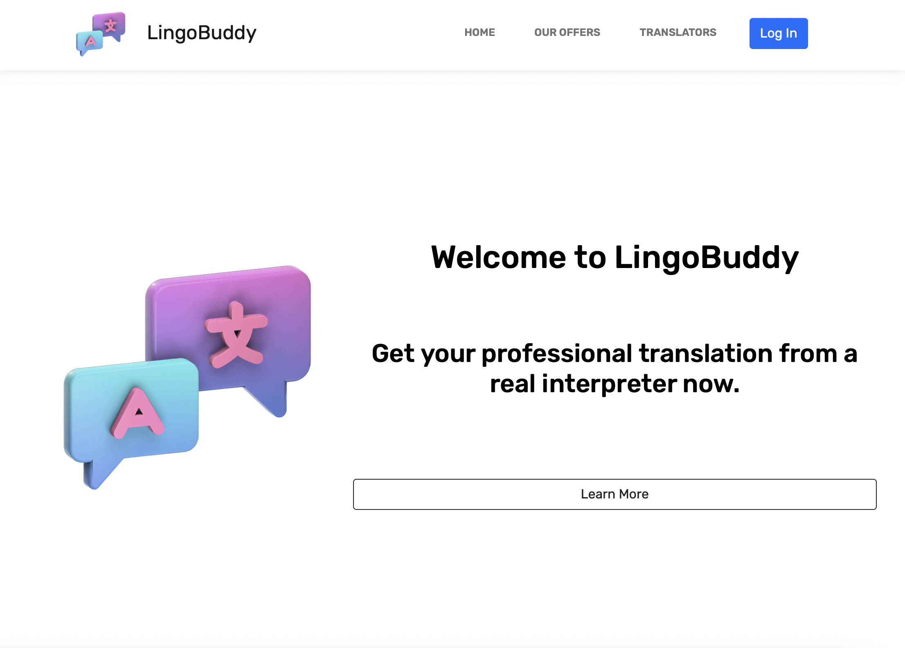
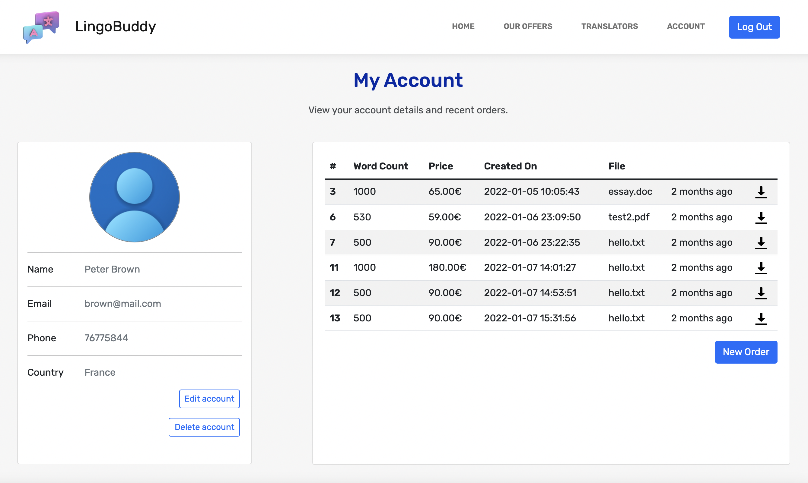
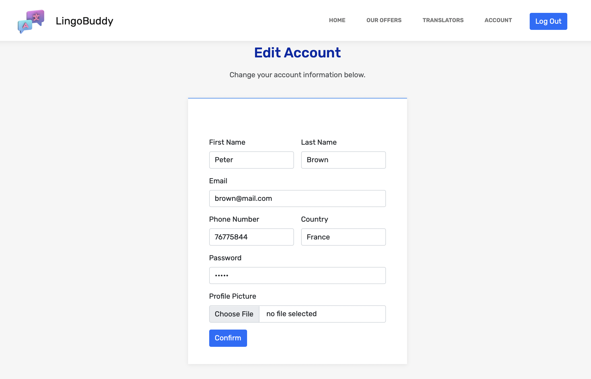

<div id="top"></div>

[![Contributors][contributors-shield]][contributors-url]
[![LinkedIn][linkedin-shield]][linkedin-url]


<!-- PROJECT LOGO -->
<br />
<div align="center">
    

<h3 align="center">LingoBuddy</h3>

  <p align="center">
    An example PHP, MySQL project built using MAMP
  </p>
</div>


<!-- TABLE OF CONTENTS -->
<details>
  <summary>Table of Contents</summary>
  <ol>
    <li>
      <a href="#about-the-project">About the Project</a>
    </li>
    <li>
      <a href="#built-with">Built With</a>
    </li>
    <li>
        <a href="#installation">Installation</a>
    </li>
    <li>
      <a href="#contributors">Contributors</a>
  </li>
    <li>
      <a href="#license">License</a></li>
    <li><a href="#contact">Contact</a></li>
  </ol>
</details>


<!-- ABOUT THE PROJECT -->
## About The Project



LingoBuddy is an example dynamic website built with PHP that connects to a MySQl database. It is a fictional translation service
that let's you create an account, edit account information, create orders and upload documents. This is my first ever PHP project,
done as a group work for a software developement course by the [@codingfactory](https://github.com/codingfactory-by-itescia).
<p align="right">(<a href="#top">back to top</a>)</p>


## Built With

* [PHP](https://www.php.net)
* [MySQL](https://www.mysql.com)
* [Bootstrap](https://getbootstrap.com)
* [MAMP](https://www.mamp.info)
* [VS Code](https://code.visualstudio.com)

<p align="right">(<a href="#top">back to top</a>)</p>


## Installation

Using MAMP is the easiest way to try this project.

1. Download and install MAMP - [https://www.mamp.info](https://www.mamp.info)
2. Clone the repo
   ```sh
   git clone https://github.com/vieiraruben/LingoBuddy.git
   ```
3. Change htdocs folder to LingoBuddy folder
4. Import /localhost.sql as database either using terminal or phpMyAdmin

<p align="right">(<a href="#top">back to top</a>)</p>


<!-- USAGE EXAMPLES -->
## Usage






<!-- CONTRIBUTING -->
## Contributors

* [@rubenvieira](https://github.com/vieiraruben)
* [@tibz](https://github.com/tibz7884)
* [@AmalGuedda](https://github.com/AmalGuedda)
* [@HD-4Code](https://github.com/HD-4Code)

<p align="right">(<a href="#top">back to top</a>)</p>


<!-- LICENSE -->
## License

Free for all uses.

<p align="right">(<a href="#top">back to top</a>)</p>


<!-- CONTACT -->
## Contact

LinkedIn Profile - [https://www.linkedin.com/in/vieiraruben](https://www.linkedin.com/in/vieiraruben/)


<p align="right">(<a href="#top">back to top</a>)</p>


<!-- MARKDOWN LINKS & IMAGES -->
<!-- https://www.markdownguide.org/basic-syntax/#reference-style-links -->
[contributors-shield]: https://img.shields.io/github/contributors/vieiraruben/LingoBuddy.svg?style=for-the-badge
[contributors-url]: https://github.com/vieiraruben/LingoBuddy/graphs/contributors
[forks-shield]: https://img.shields.io/github/forks/vieiraruben/LingoBuddy.svg?style=for-the-badge
[forks-url]: https://github.com/vieiraruben/LingoBuddy/network/members
[stars-shield]: https://img.shields.io/github/stars/vieiraruben/LingoBuddy.svg?style=for-the-badge
[stars-url]: https://github.com/vieiraruben/LingoBuddy/stargazers
[issues-shield]: https://img.shields.io/github/issues/vieiraruben/LingoBuddy.svg?style=for-the-badge
[issues-url]: https://github.com/vieiraruben/LingoBuddy/issues
[linkedin-shield]: https://img.shields.io/badge/-LinkedIn-black.svg?style=for-the-badge&logo=linkedin&colorB=555
[linkedin-url]: https://linkedin.com/in/vieiraruben
[product-screenshot]: assets/img/language-translator.png
